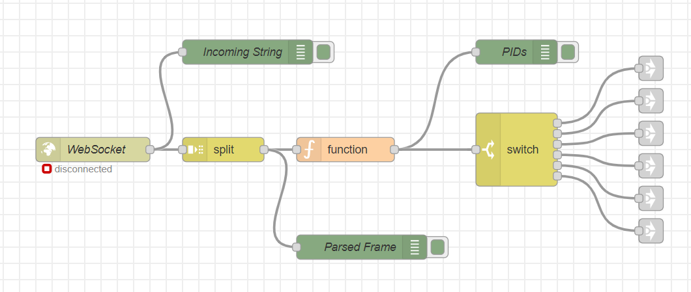
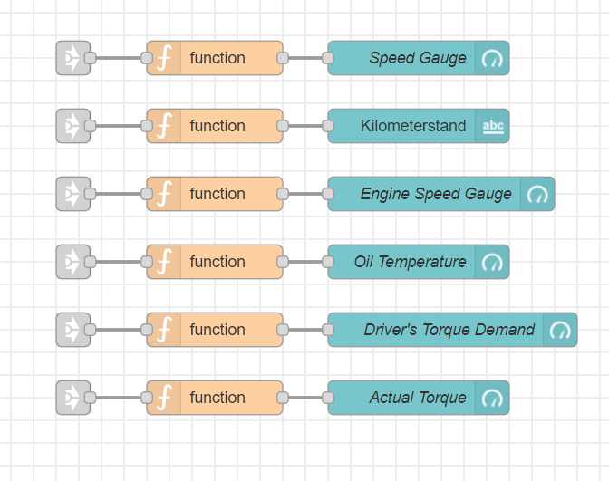
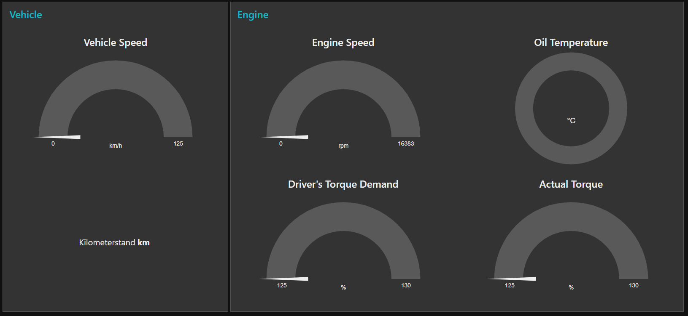

# Node-Red Integration

Node-RED is a programming tool for wiring together hardware devices, APIs and online services in new and interesting ways.

It provides a browser-based editor that makes it easy to wire together flows using the wide range of nodes in the palette that can be deployed to its runtime in a single-click.

For this project, a Node-Red Flow has been developed to monitor the state of a car through its CAN Bus. It is based on using PID Requests to the Car's ECU using the [SAE Standard](https://en.wikipedia.org/wiki/OBD-II_PIDs).

# Data Collection

This Flow receives the information from the WebSocket and parses the CAN Frame using the Lawicel Protocol. Then only the Frames which comply with the SAE Standard are allowed through to be analyzed/displayed.

# Vehicle Data

Here are the PIDs received and the Vehicle Data extracted from the Frame's data bytes. Then the information is sent to the Dashboard

# Dashboard

The Node-Red Dashboard includes several types of gauges and displays to show the information in the best way possible. Here we have 4 Gauges, one Donut and one text block.