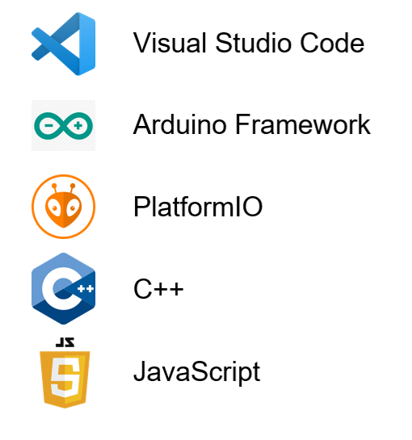

# Documentation
This folder contains the Documentation for the ESP32 CAN-Analyzer Project. 

## Design
The Project is described using numerous UML Diagrams in order to give a better image and perspective of how Software and Hardware are composed. These are written using PlantUML and are included in several of the ReadMe files on this project. 

## Software Environment

This project has been developed using PlatformIO IDE as a plugin of Visual Studio Code. This platform provides the libraries and drivers needed to work with the chosen microcontroller. 

The Firmware has been written using C++, while the Web-application has been developed using JavaScript.

## Doxygen
The software for this project has been documented using Doxygen, using a [Doxyfile](./doxyfile) to store the configuration. 
It is possible to parse the Documentation using the [Doxywizard](https://www.doxygen.nl/download.html) Programm and this configuration file.

## Media
This folder contains images of the project

## Node-Red
Here are the referencial images and Flows for the complementary Node-Red Flows