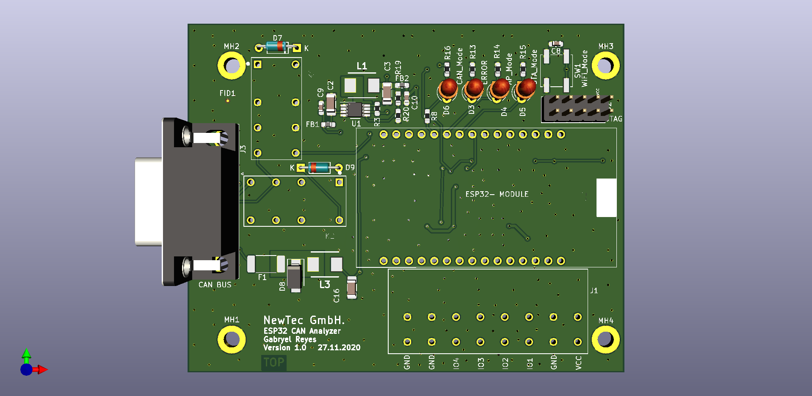

# Hardware Description

- [Architecture](#Architecture)
- [Implementation](#Implementation)
    - [CAN/OBD-II Switching](#CAN/OBD-II-Switching)
    - [Components](#Components)
    - [Version 1.0](#Version-1.0)
    - [Version 1.1](#Version-1.1)

# Architecture

This deviced is based on the ESP32­-WROOM-­32E processor, which has a diverse number of interfaces such as digital and analog inputs and output, as well as an integrated CAN bus controller and WiFi capabilities, between many other characteristics. The ESP32 additionally needs a CAN Transceiver to receive the data from the CAN-H and CAN-L lines. 

The connection to the CAN Bus is done through a DSUB-9 connector, which is the standard for CAN busses. This connector can also provide a the device with power, but with a 12V voltage which has to be reduced to 5V before going into the ESP32 DevKit, where it will be transformed again into 3.3V.

# Implementation
The Project was developed using KiCad and all its Toolchain. This includes Eeschema, Pcbnew and GerbView.

## CAN/OBD-II Switching
In order to implement this device in the automotive environment it is necessary to adapt the standard connector found in cars (OBD-II) to the standard CAN connector (D-SUB9).
This is achieved by using an OBD-II to DB9 Cable, from Sparkfun for example. The problem with this solution is that the cable does not use the same pins for the High and Low signals of the CAN-Bus:

| Pin | OBD-II | DSUB-9 |
| :------: | :------: | :------: |
| 2 | GND | CAN-LOW |
| 3 | CAN-HIGH | GND |
| 5 | CAN-LOW | --- |
| 7 | --- | CAN-HIGH |
| 9 | 12V | --- |

The main issue is the connection of the CAN signals to Ground, as this would turn off the Bus in all of its nodes and this should be prevented at all costs. 

Our solution is the use of one analog pin on the microcontroller, which detects the incoming 12V at Pin 9 when using the OBD-II option (through a 10:1 voltage divider). If the analog signal is present, two relays are closed to change the connections of the D-SUB9 connector to the rest of the board.

This solution has been proved effective and quick enough so no the bus is not distrubed in any way.

## Components

The following components were selected for this project's PCB. Smaller components such as resistors and capacitors are not included in this list, but can be found on the [BOM](./010_Implementation/BOM.xlsx).

| Component | Description |
| :---------------: | :---------------: |
| ESP32-DEVKITC-32D | Microprocessor used. Connected using socket strips |
| SS24 | Safety diode for Microprocessor in case more than one power supply is being used |
| TPS62160DGK | 12V 1A Step-down Converter |
| R452002 | 12V Fuse |
| SMAJ16A | Protective Diode at 12V input |
| G5V-2-DC5 | Relay for "smart" switching between CAN and OBD Pinout |
| BC817 | Transistor for Relay control |
| 1N4148 | Diodes for Relay protection |
| DSUB9 | Standard connector for CAN-Bus |
| SN65HVD233-HT | CAN Transceiver |
| 744242220 | Toroid for CAN-Bus Filtering |
| PESD1CAN | Diode for CAN-Bus Filtering |
| AST 045-08 | 8-position connector with latches for GPIO |
| CAB-10087 | OBD-II to DB9 Cable |

## Version 1.0
 

## Version 1.1
2 Main Errors were found on Version 1.0:
* Tx and Rx Signals from the CAN Transceiver were inverted
* The 5V Supply for the Relays was located after a diode, which prevented the use of the relays when connected only through USB Supply. 

In the new version were these two changes made and after testing it resolved in success.

Other minor errors were also repaired, such as the size of the holes for AST 045-08 Connector which were too small. 
