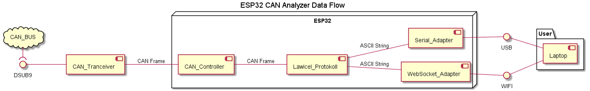

# ESP CAN-Analyzer
An ESP32 based interface between CAN-Bus and IoT environments.

This project has the main objective of interfacing a CAN Bus with the user through the use of the Lawicel Protocol (also known as SLCAN). Lawicel represents CAN Frames as strings of ASCII Symbols which can be easily interpreted by the user of by the numerous applications available online. 

- [Technical Specifications](#Technical-Specifications)
	- [Software Requirements](#Software-Requirements)
	- [Hardware Requirements](#Hardware-Requirements)
	- [Extra/Optional Requirements](#Extra/Optional-Requirements)
- [Context](#Context)
- [Use Case](#Use-Case)

# Technical Specifications 
## Software Requirements
* Support Standard and Extended frame formats
* WiFi Mode Selection (AP or STA)
* Support *Lawicel* Protocol
* HTTP Server over WiFi
* Server shall support authentication
* AP credentials changed through Server
* STA credentials changed through Server
* Bit Timing and Filters changed through Server
* CAN monitoring page (depending on available memory)
* Send CAN frame on demand
* Send CAN frame periodically
* CAN BUS Termination on Demand

## Hardware Requirements
* ESP32-based
* ISO 11898 Compliant (CAN up to 1 Mbps)
* CAN Bus Termination on Demand
* Support CAN through DSUB-9
* Support OBD through DSUB-9
* Bus-off State
* ISO 7637 compliant (Road vehicles -- Electrical disturbances from conduction and coupling)
* Control Button
* Red Error LED
* 4 GPIOs via Clamps

## Extra/Optional Requirements
* Identification of Error Message
* Reset through Webserver (Save and Restart)
* View OBD Messages (.dbc file?)
* LAWICEL over websocket/mqtt (to nodejs/node-red)

# Context

Based on the Lawicel Protocol, this project connects any standard CAN Bus to the user-end system. One example is its use on the Automotive Environment, where the CAN Bus is acquired through the DSUB-9 connector. The Frames are parsed through Lawicel into an ASCII String and sent through Serial to the Users Laptop. There is a second option, which is sending this String through a Websocket to the user. This enables the use of other IoT tools on the user's side, for example, Node-Red.

# Use Case

The use case for this project is based on the direct connection to a CAN Bus, in order to obtain the information being sent between the members of this bus. On the other side of this communication we find a Serial Interface or a Websocket Interface which presents the information to the user. The user has to provide the device with the characteristics of the Bus it is connected to, in order to correctly acquire the data.